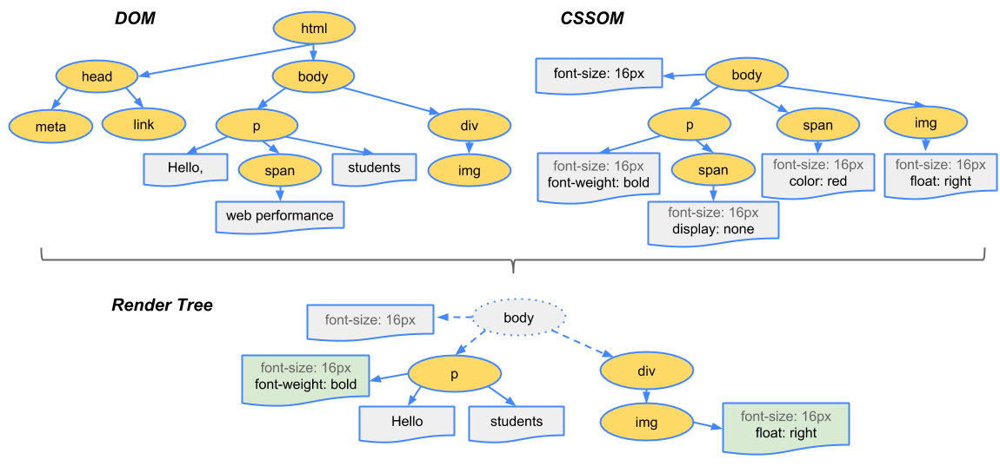
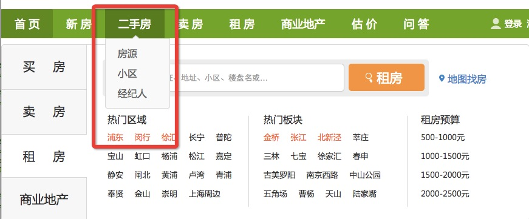

# 后端工程师也要知道的一些前端知识点

—— 启航学院之前端基础培训

## 前言

前端需要了解后端，后端需要了解前端，大家都应该做 __全栈工程师__。

### 三要素

* Html：结构层。（M）

* Css：表现层。（V）

* Javascript：行为层。（C）

原则：各司其职，减少耦合。

前端MVC框架：Angular，Backbone，Extjs

### 学习路线

1. 基础知识（html，css，js）[w3school](http://www.w3school.com.cn/)

2. jQuery（或公司的前端类库）使用，安居客使用的是自主研发的jockjs库，[Jockjs API](jockjs.corp.anjuke.com)

3. 组件学习 重复利用

4. html5，css3 移动网站

5. javascript高级程序设计 

6. 开源框架学习 

7. 全栈领域

一个优秀的前端工程师应该了解的：

## Html基础

HTML是超文本标记语言 (Hyper Text Markup Language)。

### 标签&属性

	<!DOCTYPE html>
	<html lang="zh-cn">
		<head>
			<meta charset="utf-8">
			<title>安居客 上海二手房</title>
		</head>
		<body>
			

				<h2>
					相逢是首诗
				</h2>
				

					<a href＝"xx">传送门</a>
				

			

		</body>
	</html>

### 元素类型

* 常用的块状元素有：

		
、
、<h1>...<h6>、<ol>、<ul>、<dl>、<table>、<address>、<blockquote> 、<form>

1、每个块级元素都从新的一行开始，并且其后的元素也另起一行。

2、元素的高度、宽度、行高以及顶和底边距都可设置。

3、元素宽度在不设置的情况下，是它本身父容器的100%，除非设定一个宽度。

* 常用的内联元素有：

		<a>、、 、<i>、<em>、<strong>、<label>、<q>、<var>、<cite>、<code>

1、和其他元素都在一行上；

2、元素的高度、宽度、行高及顶部和底部边距不可设置；

3、元素的宽度就是它包含的文字或图片的宽度，不可改变。

* 常用的内联块状元素有：

		、<input>

1、和其他元素都在一行上；

2、元素的高度、宽度、行高以及顶和底边距都可设置。

## Css基础

### 基本原则

与html解耦合。

	//不允许
	

		这样做不对
	

放在顶部加载。
	
	<html>
		<head>
			<link type="text/css" href="a.css">
		</head>
		<body>
		</body>
	</html>

### 选择器

* 标签选择器
		
		p{
			font-size:15px;
		}		
		
* 类选择器
		
		.header{
			font-size:14px;
			color:#f00;
		}
		
* ID选择器
		
		#footer{
			font-size:14px;
			color:#f00;
		}
		
* 后代选择器
		
		.header span{
			line-height:25px;
		}
		
* 通用选择器
		
		*{
			border:1px solid #f00;
		}
		
* 伪类选择器

一个元素达到一个特定状态时，它可能得到一个伪类的样式；当状态改变时，它又会失去这个样式。
		
		a:hover{
			color:#f00;
		}	
		p:first-child{
			font-weight: bold;
		}

:link, :hover, :active, :visited		
		
* 伪元素选择器		
	
伪元素是对元素中的特定内容进行操作。实际上，设计伪元素的目的就是去选取诸如元素内容第一个字（母）、第一行，选取某些内容前面或后面这种普通的选择器无法完成的工作。它控制的内容实际上和元素是相同的，但是它本身只是基于元素的抽象，并不存在于文档中，所以叫伪元素。

:first-letter, :first-line, :before, :after

	p:first-letter{
		font-size:16px;
	}
	
		
* 分组选择器

		.header,.footer{
			font-size:14px;
			color:#f00;
		}

### 优先级

哪一行是最终渲染的样式？
	
	#div-id{
		color:#00f;
	}
	.div-class{
		color:#0f0;
	}
	div{
		color:#f00;	
	}
	
	

		我是什么颜色？
	

	
	p{color:red;} /*权值为1*/
	
	p span{color:green;} /*权值为1+1=2*/
	
	.warning{color:white;} /*权值为10*/
	
	p span.warning{color:purple;} /*权值为1+1+10=12*/
	
	#footer .note p{color:yellow;} /*权值为100+10+1=111*/

### 继承

可以被继承的属性：

* 文本相关

		font-family, 
		font-size, 
		font-style,
		font-variant, 
		font-weight,
		letter-spacing,
		line-height,
		text-align, 
		text-indent, 
		text-transform,
		word-spacing,
		color
		
* 列表相关
		
		list-style-image, list-style-position,list-style-type, list-style

### 盒模型

	margin
	border
	padding
	内容
	
### 三种布局模型

* 流动模型

块状元素都会在所处的包含元素内自上而下按顺序垂直延伸分布，因为在默认状态下，块状元素的宽度都为100%。

内联元素都会在所处的包含元素内从左到右水平分布显示。

	div{
		width:200px;
		height:200px;
		border:2px red solid;
	}
	
	

	

* 浮动模型

		div{
			width:200px;
			height:200px;
			border:2px red solid;
			float:left;
		}
	
		

		

* 层模型
		
		div{
			width:200px;
			height:200px;
			border:2px red solid;
			float:left;
		}
		#div1{
			position: relative;
		}
		#div2{
			position: absolute;
			top:0;
			left:50px;
		}
	
		

		

### 浏览器渲染

文档对象模型（DOM）

CSS 对象模型 (CSSOM)

1. 从 DOM 树的根节点开始，遍历每个可见的节点。

	某些节点根本不可见（例如 script 标签、meta 标签等）。由于呈现的输出内容中不会反映这些节点，因此会被省略。

	某些节点通过 CSS 隐藏起来，在呈现树中也会被省略。比方说，上例中的 span 节点。由于该节点通过显式规则设置了display:none属性，因此不会出现在呈现树中。

2. 为每个可见的节点找到匹配的 CSSOM 规则，并应用这些规则。

3. 渲染可见的节点。

这里要注意css 的解析是从右向左的：

	.div1 span{
		
	}
	//层级越深效率越低
	.div1 span span{
	
	}
	
		
## Javascript基础

### 原则

与html解耦合。

在底部引入，js的加载会阻塞页面渲染。
	
	<html>
		<head>
			<link type="text/css" href="a.css">
		</head>
		<body>
		
		
		</body>
	</html>
我们的脚本会在文档中插入的确切点执行。HTML 解析器遇到脚本代码时，它会暂停构建 DOM 的流程，并对 JavaScript 引擎进行控制；JavaScript 引擎运行完后，浏览器就会从断开的地方继续运行并恢复 DOM 构建。	

### 高性能DOM操作

尽量少的dom操作。

1. 缓存dom对象

		var dom = $("#abc");
		dom...
		//不要这样
		$("#abc")...
		$("#abc")...

2. 集中插入dom节点
		
		// 千万不要这样做：
		$('#header').prepend('<ul id="menu"></ul>');
			for (var i = 1; i < 100; i++) {
			$('#menu').append('<li>' + i + '</li>');
		}	
		//应该这样
		var menu = '<ul id="menu">';
		for (var i = 1; i < 100; i++) {
			menu += '<li>' + i + '</li>';
		}
		menu += '</ul>';
		$('#header').prepend(menu);		

### 变量

必须使用var 声明，并且最好使用单一var原则；

	function getName(){
	
		var version = '',
			name = '',
			age = '';
			...
			
	}

如果不使用var，也不会报错，但是变量是全局变量，会出现明明冲突的问题；

	var version = '1.0';
	
	function getName(){
	
			version = '';
			
	}
	
### 表达式

### 运算符

### 语句

分号可选，一般都会加分号；	

### 函数

	function getName(){
		
	}

### 数组
	
	//应该这样
	var arr = [1,2,3];
	
	//不要这样
	var arr = new Array(1,2,3);
	
### 对象
	
	//应该这样
	var obj = {
		name:'Lucy',
		age:18
	};
	
	//不要这样
	var obj = new Object();
	obj.name = 'Lucy';
	obj.age = 18;

### 面向对象

### 事件

### javascript基础学习必看

[javascript基础知识学习思维图](http://www.w3cfuns.com/forum.php?mod=viewthread&tid=5598364&from=portal)

## 一些资料

* 书籍

	《JavaScript权威指南》：工具书。

	《JavaScript高级程序设计》：一本非常完整的经典入门书籍，被誉为JavaScript圣经之一，详解的非常详细。
	
* 网站
	
	咨询
	http://ourjs.com/
	
	周刊
	http://www.75team.com/weekly/
	
	综合
	http://www.w3cplus.com/
	
	综合
	http://www.html-js.com/	
	
	开源项目
	https://github.com/
	
	...
	
	
## homework 

实现以下效果：

	